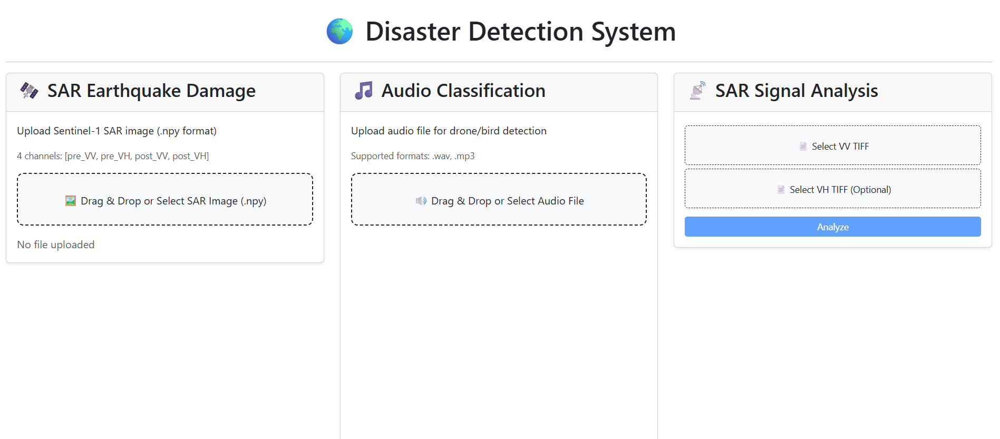
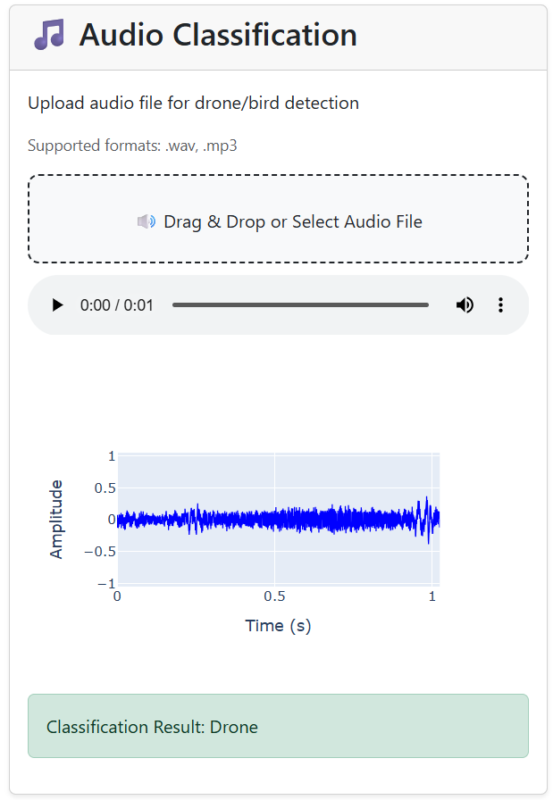
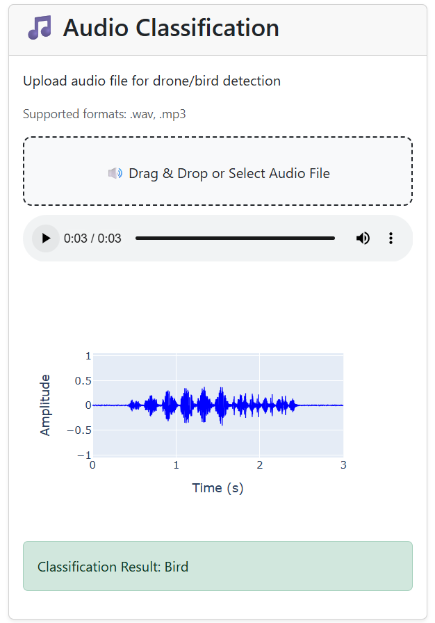
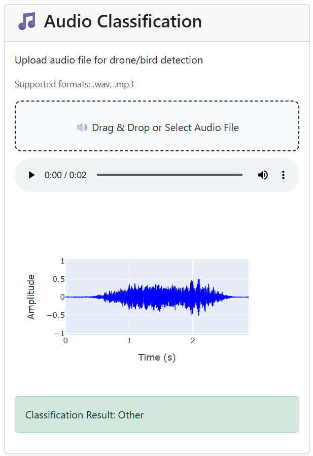

# Overview

This part focuses on detecting and visualizing signal-based phenomena using real-world acoustic and SAR (Synthetic Aperture Radar) data.

## The system provides an interactive web interface that allows users to:

1. Classify acoustic sounds — detecting drones, birds, or other sources.

2. Analyze real SAR data to detect earthquake damage using a fine-tuned deep learning model.

3. Visualize VV/VH radar channels (intensity maps and comparative visualizations).

  

   

## 1. Acoustic Signals Viewer: Drone/Bird Detection
### Functionality
- Upload an audio file (.wav or .mp3).
- Classifies the sound into one of three categories:
  - Drone
  - Bird
  - Other environmental sounds
 
### Models Used

- **Drone Detection**: Pretrained model from Hugging Face (preszzz/drone-audio-detection-05-17-trial-0)
 trained on spectrogram-based drone sound datasets.

- **Bird Detection**: Pretrained YAMNet model from TensorFlow Hub (https://tfhub.dev/google/yamnet/1
), with a custom mapping to aggregate multiple bird-related classes for improved accuracy.

### Detection Logic

The system first checks if the sound is likely a bird using YAMNet.
If not, it applies the drone model; if neither threshold is met, the sound is labeled “Other.”

The result is displayed with a short waveform plot and an audio player for playback.

  
  
  

## 2. Radiofrequency Signals Viewer: General SAR Signal Analysis
### Functionality

The system takes TIFF files — VV (required) and VH (optional) — as input.
It then processes the data to provide two main outputs:

- Visualizations of the radar backscatter patterns.

- Statistical estimations that help infer potential surface damage or urban features.

### Visualizations

- Grayscale images of VV and VH channels (normalized using 2–98% percentile contrast).

- Histogram plots showing backscatter intensity distribution in dB.

- Comparative visuals to analyze differences between VV and VH polarizations.

### Estimations & Processing

- Calculates key statistics: Mean, Standard Deviation, Min, Max, and Coefficient of Variation — indicating surface texture or roughness.

- Determines Urban Area Fraction, showing the percentage of high backscatter pixels.

- Converts raw DN values to dB backscatter (10 * log10(DN²)) and handles no-data pixels automatically.

  <video width="70%" controls>
    <source src="viewers/SAR_Drone/visuals/SAR_analysis.mp4" type="video/mp4">
    Your browser does not support the video tag.
  </video>

## 3. Radiofrequency Signals Viewer: SAR Earthquake Damage Detection
### Functionality

- Accepts a .npy file containing 4-channel SAR data: pre-event VV, pre-event VH, post-event VV, post-event VH (shape: [4, H, W]).

- Uses a fine-tuned deep learning model to classify the input as:
  - Damage (earthquake detected)
  - No Damage.

### Model Details

- Built using TorchGeo’s ResNet50 backbone, pretrained on the BigEarthNet-S2 dataset for rich Earth observation features.

- Fine-tuned on the QuakeSet dataset, which includes real Sentinel-1 SAR earthquake imagery.

- fine-tuned Model exported as quake_sar_classifier_FINAL.pth

### Detection Logic

- Compares pre- and post-event backscatter changes in VV/VH channels.

- Detects intensity increases or texture variations linked to structural damage or debris.

- Displays clear classification results and visual indicators for interpretation.

  <video width="70%" controls>
    <source src="viewers/SAR_Drone/visuals/EarthQuake_detected.mp4" type="video/mp4">
    Your browser does not support the video tag.
  </video>

